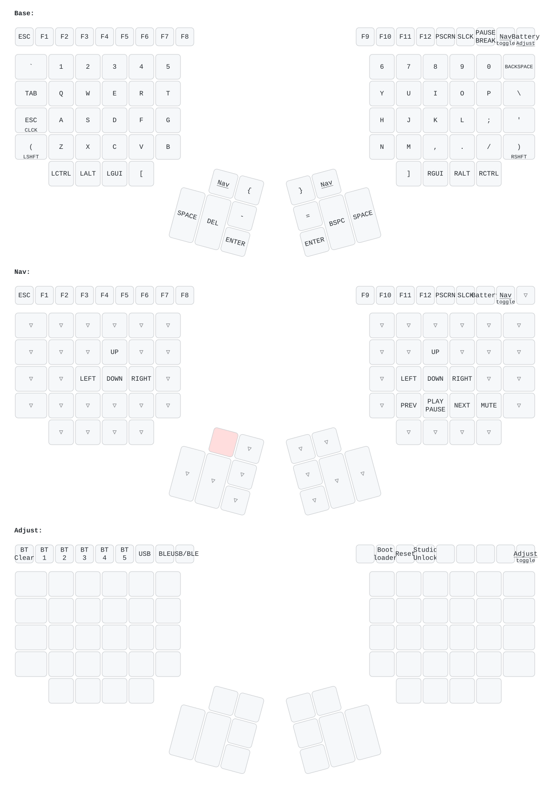

# ZMK config: Kinesis Advantage 2 BLE

ZMK firmware for a Kinesis Advantage 2 converted to Bluetooth with an Adafruit
Feather nRF52840 and an MCP23S17 column expander (the
[KinesisBLE](https://github.com/ergodone/KinesisBLE) hardware).

This repo is a ZMK module: it carries the `kinesisble` shield and keymaps, and
builds against a pinned upstream ZMK, so there is no ZMK fork to rebase.

## Keymaps

My layout ([keymap](config/kinesisble.keymap)):

The stock Advantage 2 layout that ships with the shield is drawn in
[keymap-drawer/kinesisble-stock.svg](keymap-drawer/kinesisble-stock.svg).
Both drawings are regenerated by CI whenever a keymap changes.

## Repo layout

| Path | What |
|---|---|
| `boards/shields/kinesisble/` | The shield: wiring, LED code, config, and the stock Advantage 2 keymap |
| `config/kinesisble.keymap` | My personal keymap (used by default) |
| `config/west.yml` | Pins the ZMK version |
| `build.yaml` | Which firmware variants CI builds |
| `tests/` | Keymap tests, run in CI on every push (see [tests/README.md](tests/README.md)) |
| `keymap_drawer.config.yaml` | Labels for the keymap drawings |
| `docs/kinesisble-stock.keymap` | Symlink to the stock keymap, so it is drawn under its own name |

## Getting firmware

Every push builds three UF2 files in GitHub Actions. Download them from the run's
**Artifacts**:

- `kinesisble.uf2`: personal layout
- `kinesisble-default.uf2`: stock Advantage 2 layout
- `kinesisble-debug.uf2`: personal layout with USB logging (debugging only)

## Adjustment layer

Hold **Program** (over half a second), then release, to toggle the adjustment
layer; tap Program again to leave it.

| Key | Action |
|---|---|
| Esc | Clear the current Bluetooth profile |
| F1–F5 | Bluetooth profiles 1–5 |
| F6 / F7 / F8 | Send to USB / Bluetooth / toggle between them |
| F10 | Bootloader (for flashing) |
| F11 | Reset |
| F12 | Unlock ZMK Studio |

## Flashing

Enter the bootloader (on my layout: hold **Program**, release, then press **F10**;
or double-tap the Feather's reset button), then copy the `.uf2` onto the
`FTHR840BOOT` drive. Bluetooth pairings survive reflashing.

## Remapping with ZMK Studio

Open [zmk.studio](https://zmk.studio) in Chrome or Edge and connect over USB or
Bluetooth. Before Studio can change anything, unlock the keyboard by pressing
`&studio_unlock` (on my layout: hold **Program**, release, then press **F12**).

Changes made in Studio are saved on the keyboard and override the keymap file
until you use Studio's "Restore Stock Settings", so commit any layout you want
to keep back into `config/kinesisble.keymap`.

## Updating ZMK

Change the `revision` in `config/west.yml` and the `@<ref>` in
`.github/workflows/build.yml` to the same new ZMK commit or release tag, push,
and check the build.

## Building locally

With a ZMK checkout set up for Zephyr 4.1 (for example via ZMK's dev container),
from its `app` directory:

    west build -p -b adafruit_feather_nrf52840/nrf52840/uf2 -- \
      -DSHIELD=kinesisble \
      -DZMK_EXTRA_MODULES=/path/to/zmk-config-kinesisble \
      -DZMK_CONFIG=/path/to/zmk-config-kinesisble/config

See the [shield readme](boards/shields/kinesisble/Readme.md) for LED meanings and
the debug build.
